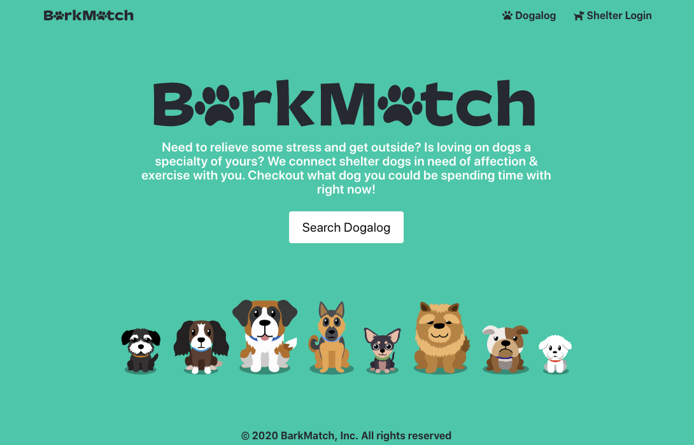

# **BarkMatch**
  
  
  ## **Table of Contents**
  * [Contributors](#contributors)
  * [Questions](#questions)
  * [License](#license)
  * [Credits](#credits)
      
  ## **Live Link**
  https://vast-river-69240.herokuapp.com/
      
  ## **Description**
  BarkMatch is a web based application that allows dog shelters to upload dogs to a database, allowing users to search for a dog and then volunteer to take them for a walk. 

  ## **Demo**
  
      
   ## **Contributors**
  * [Melanie Bostwick](https://github.com/mbostwick1)
  * [Stephany Bolivar](https://github.com/gstephbolivar)
      
  * [Rashawn Raiford](https://github.com/raiford2530)
      
  * [Robert Anderson](https://github.com/reanderson89)
  
  ## **Technology Stack**
  javascript, node.js, express.js, express-sessions, handlebars, nodemailer, passport, bulma, sequelize, mysql, jquery, heroku, jawsDB

  ## **Questions**   
  ####    **For any questions or inquiries please contact us at,**

**Melanie Bostwick**
  * #### **GitHub:** [@mbostwick1](https://github.com/mbostwick1)
  * #### **Email:** mbostwick1@gmail.com

 **Stephany Bolivar**
  * #### **GitHub:** [@gstephbolivar](https://github.com/gstephbolivar)
  * #### **Email:** g.stephanybolivar@gmail.com
  
**Rashawn Raiford**
  * #### **GitHub:** [@raiford2530](https://github.com/raiford2530)
  * #### **Email:** raiford87@gmail.com

**Robert Anderson**
  * #### **GitHub:** [@reanderson89](https://github.com/reanderson89)
  * #### **Email:** reanderson89@gmail.com

  ## **Credits**
   * [Bulma](https://bulma.io/)
   * [Jaaak | Stutterstock](https://premier.shutterstock.com/image/contributor/2723206)
   * [Dotties Vanilla: Designed by Kyle Letendre; Exclusively at Lost Type](https://latest.losttype.com/introducing/dotties)
   * [Font awesome](https://fontawesome.com/)
   * [Bulma NavBar functionality](https://codepen.io/Nikitoss334/pen/VOEdVY)
  
    
  ## **License**
  MIT
      